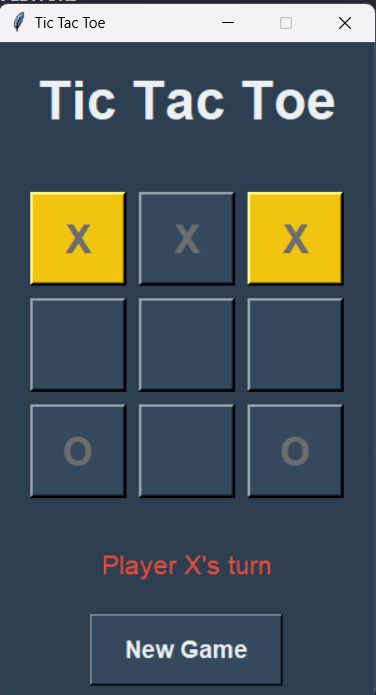

# 🎮 Modern Tic Tac Toe Game

A modern implementation of the classic Tic Tac Toe game with a sleek GUI built using Python and Tkinter.



## 📝 Project Description

This is a simple yet elegant implementation of the Tic Tac Toe game featuring a modern user interface, smooth animations, and a clean codebase. The game supports two players and includes features like move highlighting, win detection, and game state tracking.

## 🎯 Features

- 🎨 Modern and attractive GUI
- 🎪 Color-coded players (Red X, Green O)
- 🌟 Hover effects and animations
- 🎯 Win detection with highlighted winning combination
- 🔄 Easy game reset functionality
- 📊 Status display showing current player's turn

## 🚀 Installation

### Prerequisites

- Python 3.x
- Tkinter (usually comes with Python)

### Setup

1. Clone the repository:

```bash
git clone https://github.com/Parth-243/Python-Project-tic-tac-toe-game-.git
cd tic-tac-toe
```

2. Run the game:

```bash
python main.py
```

## 📁 Project Structure

```
tic-tac-toe/
├── main.py         # Game entry point
├── logic.py        # Game logic and rules
├── gui.py          # GUI implementation
├── styles.py       # Visual styles and constants
└── README.md       # Documentation
```

## 🎮 How to Play

1. Run the game using `python main.py`
2. Players take turns clicking empty squares (X goes first)
3. Get three in a row (horizontally, vertically, or diagonally) to win
4. Click "New Game" to start over

## 🎨 Game Controls

- Left Click: Make a move
- New Game Button: Reset the game board
- Close Window: Exit game

## 🌟 Features Explained

### Game Logic (`logic.py`)

- Manages game state and rules
- Handles move validation
- Checks for win/draw conditions

### GUI Design (`gui.py`)

- Modern button layout
- Color-coded players
- Interactive hover effects
- Status messages
- Win highlighting

### Styling (`styles.py`)

- Modern color scheme
- Consistent fonts
- Responsive layout
- Custom messages

## 🔮 Future Enhancements

1. Game Features

   - [ ] AI opponent
   - [ ] Difficulty levels
   - [ ] Score tracking
   - [ ] Game statistics

2. UI Improvements

   - [ ] Sound effects
   - [ ] Victory animations
   - [ ] Multiple themes
   - [ ] Responsive design

3. Gameplay Options
   - [ ] Custom board sizes
   - [ ] Time limits
   - [ ] Custom markers
   - [ ] Save/Load games

## 🤝 Contributing

Contributions are welcome! Here's how you can help:

1. Fork the repository
2. Create a feature branch

```bash
git checkout -b feature/YourFeature
```

3. Commit your changes

```bash
git commit -m 'Add YourFeature'
```

4. Push to the branch

```bash
git push origin feature/YourFeature
```

5. Open a Pull Request

## 🐛 Bug Reports

Found a bug? Please open an issue with:

- Bug description
- Steps to reproduce
- Expected vs actual behavior
- Screenshots (if applicable)

## 💻 Development

### Setting Up Development Environment

1. Clone the repository

```bash
git clone https://github.com/Parth-243/Python-Project-tic-tac-toe-game-.git
```

2. Navigate to project directory

```bash
cd tic-tac-toe
```

3. Start developing!

### Coding Standards

- Follow PEP 8 guidelines
- Add comments for complex logic
- Update documentation for new features
- Test thoroughly before submitting PR

## 👥 Author

Your Name

- GitHub: [@Part-243](https://github.com/Parth-243)
- LinkedIn: [Parth Shrivastava](https://www.linkedin.com/in/parth-shrivastava-85ba83262/)

## 🙏 Acknowledgments

- Inspired by classic Tic Tac Toe games
- Built with modern Python practices
- UI design inspired by Material Design principles

## 📞 Contact

For any queries or suggestions:

- Email: parthshrivastva24@gmail.com
- Twitter: [@Parthshrivast24](https://x.com/Parthshrivast24)

---

Happy Gaming! 🎮
